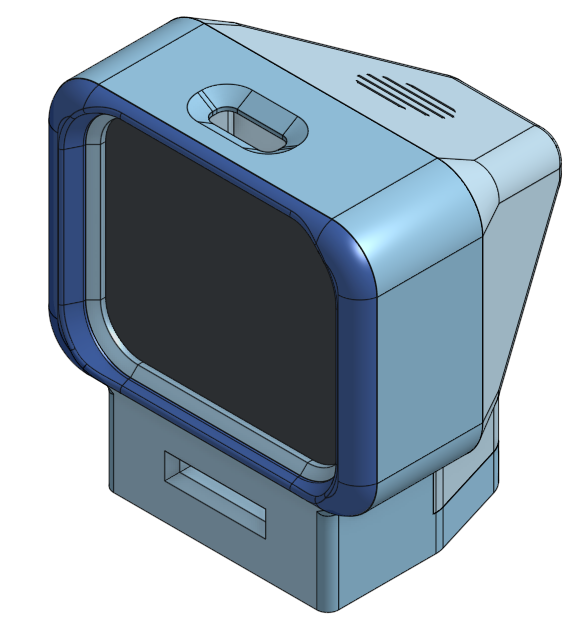
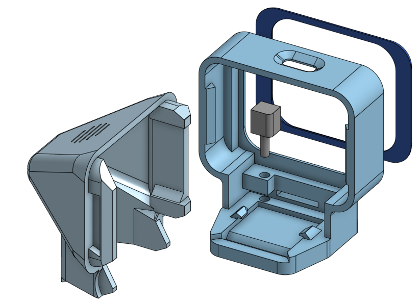

<p class="mdOnly">
# Tinytron 📺
</p>

## 📋 Overview

This project is (yet another) an ESP32 powered video player with 1.69 inch display designed specifically around the [ESP32-S3-LCD-1.69 from Waveshare](https://www.waveshare.com/wiki/ESP32-S3-LCD-1.69). 

It can play MJPEG AVI files from an SD card, or stream video content from a computer over WiFi. It features a simple web interface for configuration and can be controlled with a single physical button.

### Project goals

Tinytron was designed to be straightforward to make:

- Limited parts: only the dev board, SD card reader and battery, for a total cost of 30€ or less.
- Minimal soldering: only a 6 pin header to solder.
- Custom case: the 4 elements of the case print in 30 minutes on a Prusa MK4S.
- Quick assembly: takes about 5 minutes.
- No software to install: both flashing the firmware and converting video files can be done directly from this web page.

Note: given these goals I chose not to support audio playback in this project.

### Additional features

- Simple control using a single physical button (single press to pause/resume playback, double press to next video, long press to turn on/off).
- Battery voltage monitoring.
- Web-based control panel for device management (WiFi settings, video streaming, battery voltage and various stats).
- Over-the-Air (OTA) firmware updates.

## ⚙️ Hardware

I sourced parts from Aliexpress and Amazon, and designed the case around them.

### Bill of Materials

One of this project's goals is to keep the BOM as short as possible. Only 3 parts, and 6 easy solder joints are needed. There is no audio amp nor speaker in this project.

| Part | Notes | Link (non affiliated) |
| -- | -- | -- |
| Waveshare ESP32-S3-LCD-1.69 | This is the **non touch version**. The touch version has thicker glass and a different footprint. | [Amazon.fr](https://www.amazon.fr/dp/B0D9PTZ5DY), [Aliexpress](https://fr.aliexpress.com/item/1005009927444668.html) |
| Micro SD card reader breakout board | The case was modeled after this exact board.<br><br>Dimensions: 18x18x20mm | [Amazon.fr](https://www.amazon.fr/dp/B0DRXBF5RW) |
| 400 mAH 3.7v LiPo battery | **Important:** the default connector is PH2.0 which isn't compatible with the Waveshare dev board. I spliced a [connector](https://www.amazon.fr/dp/B09TDCLZGB) but you can custom order the correct one (JST1.25mm) from the battery seller.<br><br>Technically optional it is possible to power the device via USB C connector.<br><br>Dimensions: 6x25x30mm | [Aliexpress](https://fr.aliexpress.com/item/1005007103616809.html) |
| Micro SD card | FAT32 formatted. Also technically optional since the project can also stream video over local network. | |

### 3D printed case

The case is made of 4 parts: front, back, bezel and button. Glue is required to fix the bezel on the front part, the rest of the assembly snap fits (with pretty tight tolerances) and requires no tools. 




#### Printing instructions

<a href="assets/Tinytron.zip" download>Download the STL files</a>

The case was only tested with Prusa MK4S and PLA. It prints with 0.28mm layers in about 30 minutes and 16 grams of material. I tried my best to limit the need for supports but paint-on supports are recommended in select spots for best results.

| Part | Face on print bed | Paint on support |
| --| --| -- |
| Front | Front face | Inside of USB C slot |
| Back | Vent side | Around the curved edge on the print bed |
| Bezel | Flat side | None |
| Button | Top side | None |

## 🪛 Assembly instructions

Assembly only takes a few minutes. You'll need a drop of plastic glue or cyanoacrylate glue, a bit of elecrical tape, a soldering iron and flush cutter pliers.

### 1. Solder the header

Solder the 6 pin header to the SD breakout board. Trim the pins underneath.

### 2. Prepare the SPI cable

The ESP32 dev board comes with a cable that breaks out some IO. We need to cut some of the wires to save room, and use the rest to connect the SD card reader.

Separate the lines that we'll keep from the ones we'll cut according to the table below, triple check everything and cut the unused wires flush against the connector. You can change the suggested wiring if you update the `platformio.ini` file accordingly, but these are the default.

| Keep | Description | Cut |
| -- | -- | -- |
| <span style="color:white;background:black">&nbsp;Black&nbsp;</span> | GPIO18 | |
| <span style="color:white;background:red">&nbsp;Red&nbsp;</span> | GPIO17 | | GPIO17 | |
| | GPIO16 | <span style="color:black;background:green">&nbsp;Green&nbsp;</span> |
| | GPIO3 | <span style="color:black;background:#cea903">&nbsp;Yellow&nbsp;</span> | 
| | GPIO2 | <span style="color:white;background:black">&nbsp;Black&nbsp;</span> |
| <span style="color:white;background:red">&nbsp;Red&nbsp;</span> | SDA (GPIO11) | |
| <span style="color:white;background:#7d3a2a">&nbsp;Brown&nbsp;</span> | SCL (GPIO10) | |
| | U0TXD | <span style="color:black;background:orange">&nbsp;Orange&nbsp;</span> |
| | U0RXD | <span style="color:black;background:green">&nbsp;Green&nbsp;</span> |
| <span style="color:white;background:blue">&nbsp;Blue&nbsp;</span> | 3v3 | |
| <span style="color:white;background:purple">&nbsp;Purple&nbsp;</span> | GND | |
| | 5v | <span style="color:black;background:gray">&nbsp;Gray&nbsp;</span> |

Connect the female pin sockets from the uncut wires to the micro SD board like so:

| Cable color | Label on SD board | ESP32 pin
| -- | -- | -- |
| <span style="color:white;background:blue">&nbsp;Blue&nbsp;</span> | 3v3 | 3v3 |
| <span style="color:white;background:#7d3a2a">&nbsp;Brown&nbsp;</span> | CS | SCL | 
| <span style="color:white;background:red">&nbsp;Red&nbsp;</span> (the one <ins>next to <span style="color:white;background:black">black</span></ins> on the cable) | MOSI | GPIO17 |
| <span style="color:white;background:red">&nbsp;Red&nbsp;</span> (the one <ins>next to <span style="color:white;background:#7d3a2a">brown</span></ins> on the cable) | CLK | SDA |
| <span style="color:white;background:black">&nbsp;Black&nbsp;</span> | MISO | GPIO18 |
| <span style="color:white;background:purple">&nbsp;Purple&nbsp;</span> | GND | GND |

Then wrap a bit of electrical tape around the male pins in order to create a makeshift connector that you can easily unplug and plug back. Detach it from the SD board for now.

**⚠️ Warning:** Be very careful never to plug your home made connector the wrong way: you'd swap the Ground and 3v3 lines and and most likely damage the hardware.

### 3. Glue the bezel

The first step is to glue the bezel on the front piece. If you aren't confident that you can one shot the align,ent, use a piece of painter tape as a hinge to align the two pices, then open it, add some cyanoacrylate or plastic glue, and snap it back in pace.

### 4. Assemble the device

The rest of the assembly requires no glue nor any tool and takes about 3 minutes, but please **DO READ THE ADVICE BELOW VERY CAREFULLY BEFORE PROCEEDING**.

**⚠️ Warning:** The tolerances are very tight, **be gentle when manipulating the display or you might break it** (trust me, I know). Watch the video and respect the insertion order of the display. 

Assembly is quick, but there are 4 points to be pay attention to:

1. First, hold the case vertically and make sure the push button piece is at its lowest position when inserting the display. **Do not force if the button blocks the display!**
2. Then, be very gentle when snapping the display in its final position (use the flex of the case rather than the flex of the display, as it turns out it doesn't have any). Make sure the USB-C port is properly aligned.
3. Pay attention to plug the SPI cable to the SD card reader with the blue cable on the left or you'll fry the board.
4. Perhaps most importantly, when closing the back, also pay attention to which side to insert first and be careful not to pinch the battery. If you did, it could catch on fire.

<p class="mdOnly">Watch the 3mn uncut assembly video on YouTube</p>

https://www.youtube.com/watch?v=-QKKTKMmSjw

✨ Congratulations, your Tinytron is ready! ✨

#### Reopening the case

In case you need to reopen the case, look for the small notch (left side when facing the display), insert a flathead screwdriver and gently twist it. The case should snap back open. In my experience - and it depends on the filament used - it's rather difficult to open it with bare hands.

## ⚡ Flashing the firmware

### Web flasher

You can the latest build directly from this page: simply connect your ESP32 to this computer over USB C, click the Connect button, and follow the instructions.

<p class="mdOnly">Please visit the <a href="https://t0mg.github.io/tinytron/#web-flasher">website</a> version of this documentation to see the Web Flasher button.</p>

<p><esp-web-install-button manifest="firmware/manifest.json">
</esp-web-install-button></p>

**Note:** this is a "factory firmware", flashing it will erase the memory and any previous settings (WiFi etc.) that might be stored on your device. To update the firmware to a new version without losing your data, prefer the other methods below.

### Building locally

This project is built with [PlatformIO](https://platformio.org/). You can use the PlatformIO extension for VSCode or the command line interface.

To build the project locally and flash it to the device, connect the ESP32-S3 board via USB and run:

```bash
platformio run --target upload
```

### Over-the-air updates

Once the initial firmware is flashed, you can perform subsequent updates over the air. Connect to the device over WiFi, go to the Firmware tab, select your ota firmware file and click "Upload Firmware".

You can find a build of the latest OTA firmware [here](https://t0mg.github.io/tinytron/firmware/firmware-ota.bin), or you can build it yourself as explained below.

#### Build the binary

```bash
platformio run
```

Then, navigate to the device's web UI, go to the "Firmware" tab, and upload the `firmware.bin` file located in the `.pio/build/esp32-s3-devkitc-1/` directory of the project.

## 📼 Preparing video files

You'll need a FAT32 formatted SD Card, and properly encoded video files (AVI MJPEG). Keep the file names short, and place the files at the root of the SD Card. They will play in alphabetical order.

### Transcoding

You can use [this web page](https://t0mg.github.io/tinytron/transcode.html) to convert video files in the expected format (max. output size 2Gb). It relies on [ffmpeg.wasm](https://github.com/ffmpegwasm/ffmpeg.wasm) for purely local, browser based conversion.

For much faster conversion, the `ffmpeg` command line tool is recommended. This is what the web version does:

```sh
ffmpeg -y -i input.mp4 -an -c:v mjpeg -q:v 10 \
-vf "scale=-1:240:flags=lanczos,crop=288:240:(in_w-288)/2:0,fps=min(25, original_fps)" \
out.avi
```

In case you arent ffmpeg fluent, here's a breakdown of what this does:

| Option/Parameter | Purpose | 
| -- | -- | 
| `-y` | Overwrite output without prompt. |
| `-i input.mp4` | Input file (use your own file name here). |
| `-an` | No Audio. Discard the audio stream, we don't need it. |
| `-c:v mjpeg` | Video codec: Motion JPEG (MJPEG). |
| `-q:v 10` | High Quality (Quantizer 10), ranges [1-31], lower value is higher quality. |
| `-vf "..."` | Video Filter Chain: |
| `scale=-1:240:flags=lanczos` | Scale to 240px height, auto-width, using Lanczos algorithm. |
| `crop=288:240:(in_w-288)/2:0` | Crop to 288x240, horizontally centered. It's 8 pixels wider than the display, but the JPEG decoding library performs faster with multiples of 16. |
| `fps=min(25, original_fps)` | Set max FPS to 25, preserving original if lower. |
| `out.avi` | Output file name and container. | 

## 📖 Usage

### Powering

Long press the button (1 second) then release it to turn the Tinytron on and off.

### SD Card Mode

If a FAT32 formatted SD card containing `.avi` files is detected at boot, the device will automatically start playing them in alphabetical order. You can use the button to control the playback:

- **Single Press:** Play/Pause the video.
- **Double Press:** Play the next video file on the SD card.

In SD Card mode, WiFi is disabled to save battery.

### WiFi Mode

If no SD card is detected, the device enters WiFi mode. It will attempt to connect to the previously configured WiFi network.

- The IP address of the device will be displayed on the screen.
- You can connect to this IP address from a web browser on the same network to access the [web interface](#web-interface).

### Access Point (AP) Mode

If the device fails to connect to a previously configured WiFi network (or if no network is configured), it will start in Access Point (AP) mode.

- The device will create a WiFi network with the SSID `Tinytron`.
- This network is open and does not require a password.
- Connect to this network from your computer or phone, and you should be presented with a captive portal that opens the web interface. If not, open a browser and navigate to `192.168.4.1`.
- From the web interface, you can configure the device to connect to your local WiFi network by specifying its SSID and password. Upon saving, the device will reboot and attempt to connect. You'll then need to connect to your home network to use [Wifi Mode](#wifi-mode). If it fails to connect, it'll return to AP mode after a few seconds.

### Web Interface

The web interface allows you to:

- Configure WiFi settings.
- Adjust screen brightness and On-Screen Display (OSD) level.
- View battery status.
- Stream local video files from your computer to the device.
- Perform [Over-the-Air (OTA) firmware updates](#over-the-air-updates).

### Battery & charging

- Power consumption varies depending on usage (WiFi, brightness). In medium brightness and SD mode it can last several hours. The battery state is visible in the Web interface, as wekk as on the display if enabled in settings.
- When the battery is low, a warning appears both in the Web interface and on the display.
- The device charges over USB C. It currently cannot be turned off while charging.

## 🫰 Credits and references
- This project is relying heavily on [esp32-tv by atomic14](https://github.com/atomic14/esp32-tv) and the related [blog](http://www.atomic14.com) and [videos](https://www.youtube.com/atomic14). Many thanks !
- Another great source was [moononournation's MiniTV](https://github.com/moononournation/MiniTV).
- The [Waveshare wiki page](https://www.waveshare.com/wiki/ESP32-S3-LCD-1.69) and provideed examples were extremyly useful.
- The web UI uses the VCR OSD Mono font by Riciery Leal.
- Github pages hosted [transcoder tool](https://t0mg.github.io/tinytron/transcode.html) inspired by [this post](https://dannadori.medium.com/how-to-deploy-ffmpeg-wasm-application-to-github-pages-76d1ca143b17), uses [coi-serviceworker](https://github.com/gzuidhof/coi-serviceworker) to load [ffmpeg.wasm](https://github.com/ffmpegwasm/ffmpeg.wasm).
